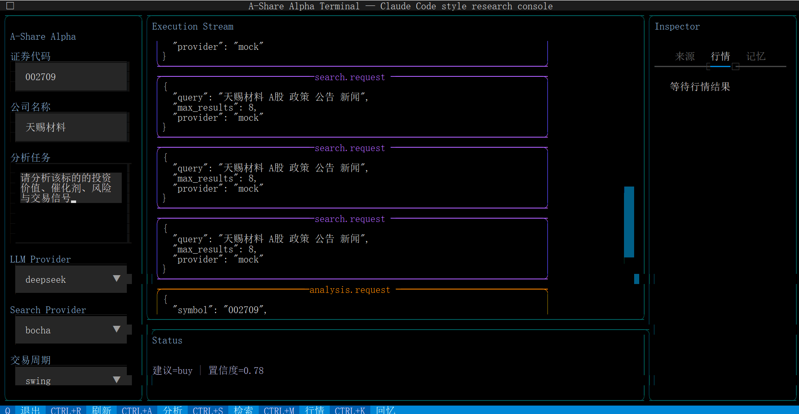
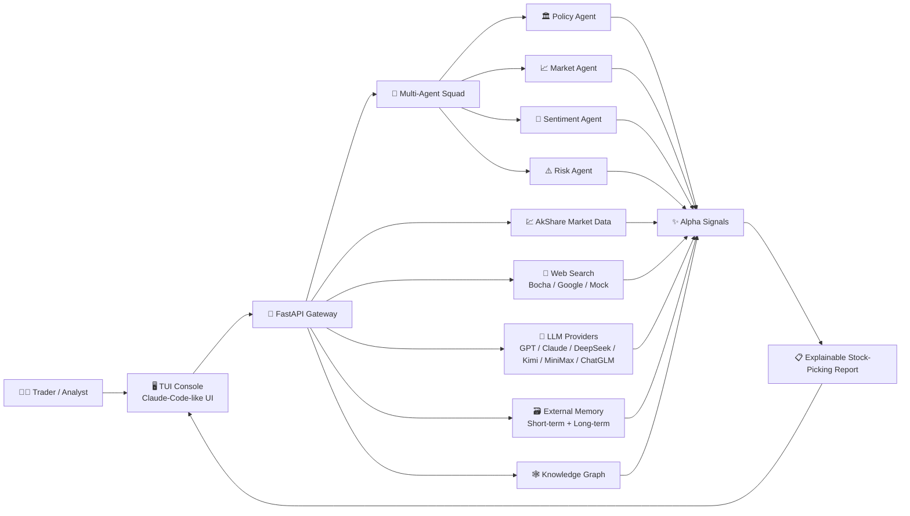

# A-Share Alpha Engine 📈

## 0. 项目介绍

**A-Share Alpha Engine** 是一个面向 A 股研究与量化交易决策的智能选股系统。项目采用 **FastAPI 后端 + Textual TUI 前端** 的架构，将行情数据、基本面数据、联网检索、多厂商 LLM、外存记忆、多智能体研判与知识图谱组织到同一个工作流中，用于生成可解释的投资机会、风险提示与阿尔法信号。

这个项目适合以下场景：

- 📊 研究 A 股标的的基本面、行情趋势、资讯催化与潜在风险
- 🤖 使用多智能体方式拆解政策、市场、情绪、风险等维度
- 🔎 聚合政策、公告、新闻等外部信息源，并保留 URL 来源
- 🧠 将研究过程写入短期/长期记忆，便于连续跟踪
- 🖥️ 在终端里使用类似 Claude Code 的 TUI 体验完成分析工作流

> 风险提示：本项目输出内容仅用于研究、学习与辅助决策，不构成任何投资建议。股票交易存在风险，实盘使用前请自行验证数据质量、模型输出和交易规则。

---

## 1. 快速启动

### 1.1 本地直接启动

推荐使用 Python 3.11。项目已提供 `requirements.txt` 和 `environment.yml`。

```bash
git clone <your-repo-url>
cd <this file>
copy .env.example .env
pip install -r requirements.txt
```

启动后端 API：

```bash
uvicorn app.main:app --reload --host 0.0.0.0 --port 8000
```

启动 TUI 前端：

```bash
python -m app.tui.main
```

Windows PowerShell 也可以使用脚本启动 TUI：

```powershell
.\scripts\run_tui.ps1
```

### 1.2 Conda 环境启动

```bash
conda env create -f environment.yml
conda activate astock-alpha
cp .env.example .env  # Windows用copy，Linux用cp
pip install -r requirements.txt
uvicorn app.main:app --reload --host 0.0.0.0 --port 8000
```

另开一个终端启动 TUI：

```bash
python -m app.tui.main
```

**效果预览：**



### 1.3 Docker Compose 启动

Docker Compose 会启动 API、Prometheus 和 Grafana。

```bash
copy .env.example .env
docker compose up --build
```

默认服务地址：

- 🚀 API: `http://127.0.0.1:8000`
- 📡 Metrics: `http://127.0.0.1:8000/metrics`
- 📈 Prometheus: `http://127.0.0.1:9090`
- 📊 Grafana: `http://127.0.0.1:3000`

### 1.4 配置说明

核心配置来自 `.env`：

```env
ENABLE_MOCKS=true
TUI_BACKEND_URL=http://127.0.0.1:8000
TUI_SESSION_ID=terminal-default
DEFAULT_LLM_PROVIDER=
DEFAULT_SEARCH_PROVIDER=
```

常用配置：

- `ENABLE_MOCKS=true`：启用 mock，适合本地开发与无 API Key 测试
- `ENABLE_MOCKS=false`：切换到真实 LLM、真实搜索和真实 AkShare 数据能力
- `TUI_BACKEND_URL`：TUI 连接的 FastAPI 后端地址
- `DEFAULT_LLM_PROVIDER`：可指定 `gpt`、`claude`、`deepseek`、`kimi`、`minimax`、`chatglm`、`mock`
- `DEFAULT_SEARCH_PROVIDER`：可指定 `bocha`、`google`、`mock`

### 1.5 测试

```bash
python -m pytest
```

当前测试覆盖 API、搜索、行情、记忆、选股分析、TUI API Client 和 TUI smoke test。

---

## 2. 项目架构

### 2.1 项目树结构

```bash
.
├── app
│   ├── api
│   │   ├── router.py
│   │   └── routes
│   │       ├── analysis.py
│   │       ├── frontend.py
│   │       ├── health.py
│   │       ├── market.py
│   │       ├── memory.py
│   │       ├── providers.py
│   │       └── search.py
│   ├── core
│   │   ├── logging.py
│   │   └── settings.py
│   ├── schemas
│   │   ├── analysis.py
│   │   ├── common.py
│   │   ├── market.py
│   │   ├── memory.py
│   │   └── search.py
│   ├── services
│   │   ├── agents
│   │   │   └── orchestrator.py
│   │   ├── kg
│   │   │   └── graph_service.py
│   │   ├── llm
│   │   │   ├── base.py
│   │   │   ├── clients.py
│   │   │   └── factory.py
│   │   ├── market
│   │   │   └── data_service.py
│   │   ├── memory
│   │   │   ├── manager.py
│   │   │   └── store.py
│   │   └── search
│   │       ├── base.py
│   │       ├── factory.py
│   │       └── providers.py
│   ├── tui
│   │   ├── app.py
│   │   ├── client.py
│   │   ├── main.py
│   │   └── styles.tcss
│   └── main.py
├── data
│   └── memory.db
├── docker
│   ├── prometheus.yml
│   └── grafana
├── logs
│   └── app.log
├── scripts
│   ├── bootstrap.ps1
│   └── run_tui.ps1
├── tests
│   ├── conftest.py
│   ├── test_api.py
│   └── test_tui.py
├── docker-compose.yml
├── Dockerfile
├── environment.yml
├── requirements.txt
└── README.md
```

### 2.2 项目流程图



---

## 3. 后端结构

### 3.1 技术栈

- **FastAPI**：REST API 服务入口
- **Pydantic / Pydantic Settings**：请求响应模型与 `.env` 配置管理
- **Httpx**：调用 LLM 和搜索服务
- **AkShare**：A 股行情与基本面数据
- **SQLite / aiosqlite**：外存记忆
- **NetworkX**：知识图谱结构构建
- **Prometheus FastAPI Instrumentator**：指标采集
- **python-json-logger**：结构化日志

### 3.2 后端核心原理

后端的核心是一个多智能体分析管线：

1. API 接收股票代码、公司名、分析任务、LLM Provider、Search Provider 等参数
2. 搜索服务检索政策、公告、新闻等外部信息，并按可信度排序
3. 行情服务通过 AkShare 或 mock 数据提供日 K、分 K 和基本面指标
4. 多智能体编排器并行调用政策、市场、情绪、风险 Agent
5. LLM 对各智能体任务进行深度解读、情绪判断和影响评估
6. 知识图谱服务把标的、指标、资讯和影响关系结构化
7. 记忆服务把研究内容写入短期和长期外存
8. API 返回摘要、建议、置信度、阿尔法信号、风险、机会、来源 URL 和图谱数据

### 3.3 后端文件结构

```bash
app/api
├── router.py              # 统一注册 API 路由
└── routes
    ├── analysis.py        # POST /analysis/stock-pick
    ├── frontend.py        # GET /frontend/bootstrap
    ├── health.py          # GET /health
    ├── market.py          # GET /market/kline, /market/fundamentals
    ├── memory.py          # POST /memory/remember, /memory/recall
    ├── providers.py       # GET /providers/status
    └── search.py          # POST /search/query

app/services
├── agents/orchestrator.py # 多智能体分析编排
├── kg/graph_service.py    # 知识图谱构建
├── llm                    # 多厂商 LLM 适配
├── market/data_service.py # AkShare / mock 行情数据
├── memory                 # SQLite 短期 + 长期记忆
└── search                 # Bocha / Google / mock 搜索
```

### 3.4 主要 API

- `GET /api/v1/health`
- `GET /api/v1/providers/status`
- `GET /api/v1/frontend/bootstrap`
- `POST /api/v1/search/query`
- `GET /api/v1/market/kline`
- `GET /api/v1/market/fundamentals`
- `POST /api/v1/analysis/stock-pick`
- `POST /api/v1/memory/remember`
- `POST /api/v1/memory/recall`

---

## 4. 前端结构

### 4.1 技术栈

- **Textual**：Python TUI 框架，用于构建终端交互界面
- **Rich**：Markdown、JSON、Panel 等终端渲染能力
- **Httpx**：TUI 调用 FastAPI 后端
- **TCSS**：Textual 样式文件，定义布局、颜色和组件风格

### 4.2 前端设计原则

TUI 采用类似 Claude Code 的信息密度和终端交互风格：

- 左侧是控制台，负责输入股票代码、公司名、任务和 Provider
- 中间是执行流，展示请求、响应摘要和关键状态
- 右侧是 Inspector，按标签页展示摘要、信号、来源、行情、记忆、图谱
- 快捷键和按钮并存，适合键盘党和普通用户
- 不依赖浏览器，适合服务器、研究终端和本地开发环境

### 4.3 前端文件结构

```bash
app/tui
├── app.py          # TUI 主界面、事件处理、功能编排
├── client.py       # 后端 API Client
├── main.py         # python -m app.tui.main 启动入口
└── styles.tcss     # Claude-Code-like 终端风格样式
```

### 4.4 TUI 与后端的关系

```bash
TUI Input
  └── BackendClient
        └── FastAPI /api/v1/*
              ├── analysis
              ├── search
              ├── market
              ├── memory
              └── providers
```

TUI 不直接访问数据库、LLM 或 AkShare。它只通过 REST API 调用后端，因此前后端边界清晰，后续也可以替换成 Web UI、桌面端或外部量化系统。

---

## 5. 使用指南

这一部分从 TUI 前端视角说明系统怎么用。启动后端后，运行：

```bash
python -m app.tui.main
```

进入界面后，你会看到三块区域：

- 🧭 左侧控制区：输入参数、选择模式、触发功能
- 📝 中间执行流：显示请求、响应和系统状态
- 🧪 右侧 Inspector：查看分析结果、信号、来源、行情、记忆和知识图谱

### 5.1 输入区说明

#### 证券代码

输入 A 股代码，例如：

```text
000001
```

后端会用该代码查询行情、基本面，并作为多智能体分析目标。

#### 公司名称

可选项，例如：

```text
平安银行
```

公司名称会被用于联网检索，让搜索结果更贴近目标公司。

#### 分析任务

用于告诉系统你想关注什么，例如：

```text
请分析该标的近期政策催化、业绩变化、市场情绪和主要风险。
```

这段内容会进入多智能体分析流程，也可以写入记忆。

### 5.2 Provider 模式

#### LLM Provider

可选模式包括：

- `mock`：本地 mock 模式，适合无 API Key 测试
- `gpt`：OpenAI GPT 系列
- `claude`：Anthropic Claude
- `deepseek`：DeepSeek
- `kimi`：Kimi / Moonshot
- `minimax`：MiniMax
- `chatglm`：ChatGLM / 智谱

如果 `.env` 只配置了一个可用 LLM Key，系统会自动使用该厂商。若 `ENABLE_MOCKS=true`，默认优先使用 `mock`，避免测试时误调用真实 API。

#### Search Provider

可选模式包括：

- `mock`：本地 mock 搜索结果
- `bocha`：Bocha Search API
- `google`：Google Custom Search API

搜索结果会保留 URL 来源，并按大致可信度排序：

```text
国家政策 > 公司/企业官方渠道 > 新闻媒体 > 网友评论
```

### 5.3 交易周期模式

TUI 当前提供三类研究周期：

- `intraday`：偏日内观察，适合结合分 K 数据查看短线变化
- `swing`：偏波段研究，适合综合行情、情绪和催化因素
- `position`：偏中长期持仓，适合更重视基本面与政策背景

当前后端会接收该字段，作为分析请求的一部分保留；后续可以继续扩展为不同 prompt、不同指标权重或不同风险阈值。

### 5.4 风险偏好模式

TUI 当前提供三类风险偏好：

- `conservative`：保守型，更关注风险、回撤和不确定性
- `balanced`：均衡型，综合机会与风险
- `aggressive`：进取型，更关注催化、弹性和潜在超额收益

当前后端会接收该字段，后续可进一步用于调整多智能体权重。

### 5.5 功能按钮

#### 分析 📈

点击 `分析` 或按 `Ctrl+A`，系统会执行完整的选股分析流程：

1. 读取左侧输入
2. 调用 `/api/v1/analysis/stock-pick`
3. 检索资讯来源
4. 获取行情和基本面
5. 运行多智能体分析
6. 构建知识图谱
7. 在右侧展示摘要、信号、来源和图谱

输出内容包括：

- `summary`：综合分析摘要
- `recommendation`：`buy` / `hold` / `reduce`
- `confidence`：置信度
- `alpha_signals`：阿尔法信号
- `risks`：风险提示
- `opportunities`：机会提示
- `sources`：带 URL 的来源列表

#### 检索 🔎

点击 `检索` 或按 `Ctrl+S`，系统会调用 `/api/v1/search/query`。

适合在正式分析前先检查外部信息源，例如政策、公告、新闻报道和市场评论。结果会展示在右侧 `来源` 标签页。

#### 行情 💹

点击 `行情` 或按 `Ctrl+M`，系统会调用：

- `/api/v1/market/kline`
- `/api/v1/market/fundamentals`

如果勾选 `包含分时数据`，TUI 会请求 `5min` 周期；否则请求 `daily` 日 K。

#### 记忆 🧠

点击 `记忆`，系统会把当前分析任务写入外存：

- 短期记忆：带 TTL，适合当前会话上下文
- 长期记忆：写入 SQLite，并保存简化 embedding，用于后续召回

对应接口：

```text
POST /api/v1/memory/remember
```

#### 回忆 🗃️

点击 `回忆` 或按 `Ctrl+K`，系统会根据当前分析任务召回相关记忆。

对应接口：

```text
POST /api/v1/memory/recall
```

召回结果会展示在右侧 `记忆` 标签页，方便做连续跟踪。

### 5.6 右侧 Inspector 标签页

- `摘要`：展示 LLM 生成的综合结论
- `信号`：展示多智能体生成的 Alpha Signal
- `来源`：展示搜索来源、URL、摘要和来源类型
- `行情`：展示最近 K 线和基本面指标
- `记忆`：展示短期与长期记忆结果
- `图谱`：展示知识图谱节点和边的 JSON 结构

### 5.7 快捷键

```text
Ctrl+A  执行分析
Ctrl+S  执行检索
Ctrl+M  刷新行情
Ctrl+K  回忆记忆
Ctrl+R  刷新后端与 Provider 状态
q       退出 TUI
```

### 5.8 推荐工作流

```text
输入股票代码
  ↓
填写公司名称和分析任务
  ↓
选择 LLM / Search Provider
  ↓
点击「检索」查看外部信息源
  ↓
点击「行情」查看价格与基本面
  ↓
点击「分析」生成多智能体研判
  ↓
查看摘要、信号、风险、机会和来源
  ↓
点击「记忆」沉淀研究上下文
  ↓
下次点击「回忆」继续跟踪
```

---

祝你研究顺利，交易冷静，数据说话。📊🚀

